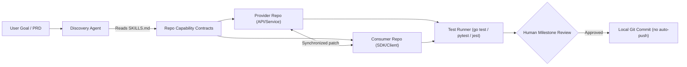

# ASCM — Autonomous Software Coordination & Multi-Agent Engineering Squad
## Revised Enterprise Pitch Deck & B2B Go-To-Market Kit
### (Revision 2 — Addresses investor due-diligence feedback)

> **Stage**: Pre-revenue, open-source proof-of-concept. Seeking first design partners.
> **Status**: Working prototype with 89 automated tests, 3 reference implementations, no paying customers yet.

---

# Part 1: The 12-Slide Enterprise Pitch Deck

### Slide 1: Title & Hook

* **Headline**: **ASCM** — Multi-Agent Orchestration for Cross-Repository Software Engineering
* **Sub-headline**: Beyond single-file autocomplete — coordinating AI agents across multiple repositories, with human approval at every gate.
* **Stage**: Pre-revenue open-source proof-of-concept | Seeking 3–5 paid design partners
* **One-Liner**: *ASCM replaces fragmented AI code assistants with a coordinated squad of specialized agents — Product Manager, Systems Architect, Polyglot Coder, Adversarial Critic, and Security Auditor — that ships a feature from PRD to reviewed Git commit across multiple repositories.*

---

### Slide 2: The Enterprise Problem (Evidence-Backed)

**Why AI coding assistants stall at the team level**

* **Single-Repo Myopia**: GitHub Copilot, Cursor, and Codeium complete individual lines and files. None coordinate a schema change across a backend API, consumer SDK, and integration tests simultaneously. This is the #1 reported pain in engineering team retrospectives (Stack Overflow Developer Survey 2024).
* **Unreviewed AI Output**: Studies (GitClear 2024) show AI-assisted codebases experience measurably higher churn/revert rates. The root cause: the same model that writes code also "reviews" it, sharing the same blind spots.
* **IP & Compliance Blockers**: Healthcare (HIPAA/HITECH), defense (ITAR/EAR), and legal (attorney-client privilege) organizations are legally restricted from sending source code to external cloud LLMs. This is a real, documented procurement blocker — not a hypothetical.
* **Uncontrolled Token Spend**: Teams using open-ended agentic loops report unpredictable API spend with no pre-flight visibility into cost.

---

### Slide 3: The Solution — ASCM

**A human-governed, multi-agent engineering squad**

Instead of one model doing everything:

* 🎯 **Product Agent**: Requires ≥ 90% confidence on requirements before proceeding. Asks domain-specific questions rather than accepting vague PRDs.
* 🏛️ **Architect Agent**: Produces High-Level Design, Low-Level Design, and a discrete task DAG. Reviewable by humans before any code is written.
* 💻 **Coder Agent**: Generates code alongside mandatory unit tests (Go/testify, Python/pytest, TypeScript/Jest). No test suite = blocked milestone.
* 🔍 **Adversarial Critic**: A *different* LLM (configurable: Claude, GPT-4o, DeepSeek) independently reviews generated code. Eliminates self-confirmation bias by design.
* 🛡️ **Security Auditor**: Path-traversal prevention, SHA-256 audit logs, outbound PII scrubbing. No file written outside declared repo allowlists.
* 👤 **Human Gate**: Mandatory human approval at Requirements, Architecture, and Pre-Commit milestones. ASCM proposes; humans decide.

**What ASCM does not claim**: Eliminating all hallucinations (no tool can), replacing human code review, or autonomous production deployment.

---

### Slide 4: How It Works — SKILLS.md Capability Contracts

**Multi-repo coordination via declarative contracts**



* Each repo declares allowed modification paths, language, and role in a `SKILLS.md` file.
* ASCM patches both sides atomically, ensuring no API contract drift.
* All file writes are validated against allowlists. `.git`, `.agents`, `.codex` are always protected.
* **Current limitation**: Requires local filesystem access. Remote cloud repo support is a planned roadmap item.

---

### Slide 5: Differentiation — What We Can Demonstrate vs. What Is Planned

| Capability | Status | Evidence |
|:--- |:---: |:--- |
| Multi-repo atomic patching | ✅ Working | 3 reference implementations across different language stacks |
| Adversarial multi-model critic | ✅ Working | Configurable via --provider flag; tested with Gemini, Claude, GPT-4o |
| Air-gapped local SLM mode | ✅ Working | Ollama integration; tested with Qwen 2.5 Coder 7B locally |
| P90 token cost forecaster | ✅ Working | Pre-flight estimate before any LLM call; circuit breaker on overrun |
| Mandatory TDD enforcement | ✅ Working | Coder agent blocked from milestone confirm without passing tests |
| SOC 2 structured audit logs | ✅ Working | SHA-256 JSONL audit trail + PII scrubber in security module |
| GitHub PR auto-creation | ✅ Working | gh pr create integration via git_service.py |
| SWE-bench published score | ❌ Not yet | Planned for design partner phase |
| Production customer deployments | ❌ Not yet | Pre-revenue; seeking first paid design partners |
| Human intervention rate metrics | ❌ Not yet | Will be instrumented during design partner pilots |
| Independent cost reduction benchmarks | ❌ Not yet | Internal estimates only; requires controlled study |

**Honest moat**: Multi-repo coordination + adversarial critic + air-gapped local SLM is a combination no current public tool offers together. Moat deepens with domain blueprint accumulation and customer-specific SKILLS.md contracts (switching cost).

---

### Slide 6: Go-To-Market Focus vs. Technical Versatility

**These are two separate things — both matter**

**Technical versatility (the moat)**: ASCM already generates working, tested code across three completely unrelated domains — financial infrastructure, blockchain payments, and CNC manufacturing. This is not a claim; it is a reproducible fact. Clone the repo and run the demos.

This cross-domain capability is what makes ASCM's engine defensible. A competitor cannot replicate three working vertical implementations by changing a system prompt.

**GTM focus (discipline)**: We are leading our sales motion with FinTech / Web3 because that is where our evidence is deepest and procurement friction is lowest.

**Why FinTech/Web3 first (GTM)**:
- Strongest existing proof: two working multi-repo implementations (PayPulse Sentinel + Pay-Through-Crypto)
- Fast-moving teams with complex multi-service architectures and strict security requirements
- Regulatory pressure creates urgency for auditable, human-approved code changes
- Lower procurement friction than healthcare or defense (no HIPAA BAA or ITAR licensing required)
- FinTech/Web3 buyers are more likely to pilot open-source tools before enterprise procurement

**Expansion playbook (post-beachhead)**:

| Vertical | Evidence | Entry Trigger |
|:--- |:--- |:--- |
| **CAD/CAM Manufacturing** | ✅ Working CNC toolpath generator (G-code, bounding box, 29 tests) | First manufacturing design partner signs |
| **MedTech / Healthcare** | 🔧 Domain adapter defined; FHIR/HIPAA NFRs in product agent | HIPAA BAA template ready |
| **LegalTech** | 🔧 Domain adapter defined; contract AST grilling in product agent | First legal firm design partner |
| **Defense / Aerospace** | 🔧 Air-gapped SLM mode ready | ITAR-cleared customer engages |

**The investor-relevant point**: We are not spreading sales resources across 6 verticals. We have one beachhead. The other verticals are expansion optionality backed by working technical proof — not wishful TAM expansion.

---

### Slide 7: Air-Gapped Enterprise Deployment

**For regulated industries where cloud LLMs are a procurement blocker**

* **Architecture**: ASCM runs entirely on-premise. Orchestrator, agents, and LLM inference all execute within the customer's firewall.
* **Supported local models** (via Ollama):
  * `qwen2.5-coder:7b` / `qwen2.5-coder:14b` — general software engineering tasks
  * `phi4:14b` — reasoning-heavy design tasks on Apple Silicon
  * `deepseek-coder-v2` — code generation (self-hosted)
* **Honest caveat**: Local SLM output quality is lower than frontier models. For complex multi-repo coordination, 70B+ models on NVIDIA workstations are recommended. Quality benchmarks on identical tasks are in progress.
* **Compliance artifacts**: Structured JSONL audit logs with SHA-256 hash chains generated for every agent action, LLM call, and governance decision. Compatible with ELK, Loki, and Datadog.

---

### Slide 8: Technical Evidence — Domain-Agnostic Engine, Focused GTM

**Three working reference implementations spanning three unrelated domains (open-source, reproducible)**

| Application | Domain | Repos Coordinated | Tests | Status |
|:--- |:--- |:---: |:---: |:---: |
| PayPulse Sentinel | FinTech SaaS | 2 (API + Portal) | 32 passing | GTM beachhead |
| Pay Through Crypto | Web3 Infrastructure | 2 (Gateway + Portal) | 28 passing | GTM beachhead |
| CNC CAD/CAM Engine | Advanced Manufacturing | 1 | 29 passing | Expansion proof |
| **Total** | | **5 repos** | **89/89 passing** | |

**Why showing all three matters to investors**:

The CNC CAD/CAM implementation is not a distraction — it is evidence that ASCM's domain adaptation engine is real. When the ProductAgent switches from asking about EVM block confirmation depth to asking about spindle RPM and B-Rep geometry, that is the same underlying architecture working across domains that share zero vocabulary.

A competitor cannot replicate this by tweaking prompts. The DomainAdapter, blueprint engine, and SKILLS.md contract system have to work generically — and demonstrating that across maximally different domains (payments vs. precision machining) is a stronger proof than three similar FinTech demos.

**Framing for the pitch**: "We have one focused sales motion (FinTech/Web3) and three reproducible domain proofs. The proofs exist to validate the engine, not to claim six simultaneous markets."

**What design partners will establish**:
- Human intervention rate per sprint (how many milestone gates required rework)
- Defect rate of AI-generated vs. human-written code in the same codebase
- Actual time-to-feature vs. baseline for the same engineering team
- Reproducible benchmark comparison against Devin, SWE-agent, and Copilot Workspace on identical tasks

---

### Slide 9: Unit Economics — Transparent Model

**What a sprint actually costs today (based on internal reference runs)**

| Cost Component | Estimate | Notes |
|:--- |:--- |:--- |
| LLM inference (Gemini 2.5 Flash) | $0.50 – $8.00 per sprint | Depends on codebase size, complexity, retry loops |
| LLM inference (GPT-4o / Claude) | $3.00 – $25.00 per sprint | Used for architect + critic tiers |
| Blueprint reuse discount | 30–60% reduction (est.) | When a known domain blueprint is matched. **Not independently validated at scale.** |
| Human review time | 0.5 – 2 hrs per sprint | Milestone gate reviews by a developer — not eliminated by ASCM |
| Infrastructure (self-hosted) | $0 | No ASCM cloud infrastructure cost in current model |

**What we do not yet know** (to be established with design partners):
- True developer time saved per feature with a controlled baseline measurement
- Retry rate and rework cost in production brownfield codebases
- Optimal LLM tier routing to minimize cost without quality regression

**Design partner economics**: Fixed-fee 90-day pilot ($5,000–$10,000). Customer provides repo access and a developer as milestone reviewer. ASCM provides onboarding, setup, and support.

---

### Slide 10: Business Model & Pricing

| Tier | Price | Target | Status |
|:--- |:--- |:--- |:--- |
| **Community (BYOK)** | Free / Open-Source | Individual developers | Live |
| **Pro** | $49/seat/mo | Startup engineering teams | Proposed — not validated |
| **Team** | $199/seat/mo | Growth-stage SaaS | Proposed — not validated |
| **Enterprise On-Prem** | $15k–$50k/yr | Regulated industries | Proposed — not validated |

**Pricing status**: Proposed based on market comparables. None validated by customer willingness-to-pay. The 90-day design partner pilot is the validation mechanism.

---

### Slide 11: Competitive Landscape

**Positioned against modern agentic coding tools**

| Capability | ASCM | Copilot Workspace | Devin (Cognition) | SWE-agent / OpenHands | Cursor |
|:--- |:---: |:---: |:---: |:---: |:---: |
| **Multi-repo atomic coordination** | ✅ Native | ⚠️ Single repo | ⚠️ Single repo | ⚠️ Single repo | ❌ File-level |
| **Adversarial multi-model critic** | ✅ Configurable | ❌ None | ❌ Self-review | ❌ Self-review | ❌ None |
| **Air-gapped local SLM** | ✅ Ollama native | ❌ Cloud only | ❌ Cloud only | ⚠️ Partial | ❌ Cloud only |
| **Human-in-the-loop gates** | ✅ Mandatory | ⚠️ Optional | ⚠️ Optional | ⚠️ Optional | ❌ Inline only |
| **Pre-flight token cost forecast** | ✅ P50/P90 | ❌ None | ❌ None | ❌ None | ❌ None |
| **Mandatory TDD enforcement** | ✅ Gate-blocked | ⚠️ Suggested | ⚠️ Suggested | ⚠️ Suggested | ❌ Optional |
| **Open-source / self-hostable** | ✅ Full OSS | ❌ Proprietary | ❌ Proprietary | ✅ OSS | ❌ Proprietary |
| **SWE-bench published score** | ❌ Not yet | ❌ Not published | ✅ ~13.86% | ✅ ~12–18% | ❌ Not published |

**Honest note**: Devin and SWE-agent have published benchmark scores on single-repo tasks. ASCM's differentiation is architectural. Independent benchmark runs are a design partner deliverable.

---

### Slide 12: The Ask & Investment Fundamentals

**Current State**
* **Stage**: Pre-revenue, open-source proof-of-concept
* **Paying customers**: 0 (design partner pilots being sought)
* **ARR**: $0
* **GitHub**: github.com/gopikomanduri/ascm-poc (public, reproducible)
* **Valuation / cap table / burn**: To be provided in a separate data room upon investor NDA

**The 90-Day Design Partner Program**
* **Target**: 3–5 FinTech / Web3 engineering teams
* **Pricing**: $5,000–$10,000 fixed fee per 90-day pilot
* **ASCM delivers**: Onboarding, SKILLS.md scaffolding, 2–3 cross-service sprints, documented outcome metrics
* **Partner delivers**: Repo access, 1 developer as milestone reviewer, before/after measurement

**Pilot data will establish**:
- Validated human intervention rate and rework frequency
- Measurable developer time saved with a control baseline
- Blueprint for repeatable enterprise sales motion

**Immediate ask (no capital required)**: Introductions to FinTech / Web3 engineering teams willing to run a 90-day pilot.

---

# Part 2: LinkedIn Campaign (Evidence-First)

### Post 1: The Problem Statement

```
The honest problem with AI coding tools in 2026:

They're great for individual developers. They break down the moment your team has more than one repo.

Here's what I mean:
• Your backend API lives in Repo A (Go microservice)
• Your client SDK lives in Repo B (TypeScript)
• Your integration tests live in Repo C

When you ask Copilot or Cursor to "add a new payment method endpoint," they update Repo A.
Repo B and Repo C? Still expecting the old API contract. Your CI breaks. Your SDK consumer is blocked.

This is the multi-repo coordination problem. It's unsolved by today's autocomplete-class tools.

We built ASCM to address it.

ASCM reads declarative SKILLS.md contracts from each repo, classifies which repos are providers and consumers, and patches both sides atomically — with mandatory unit test suites and human approval at each milestone.

It's a proof-of-concept today (open-source, 89 tests passing, 3 working reference implementations).
It's not a finished product. It's not eliminating hallucinations. It's adding structure and adversarial review to AI-generated changes before they reach your codebase.

FinTech/Web3 teams interested in a paid pilot: DM me "PILOT" or founders@ascm.dev

#EngineeringLeadership #MultiAgentSystems #DevTools #OpenSource
```

---

### Post 2: Adversarial Critic Design

```
One underappreciated problem with AI code generators:

The same model that writes the code is usually asked to review it.

Structurally similar to asking someone to proofread their own work immediately after writing it. The same reasoning errors that produced the code make the errors invisible during review.

In ASCM, we enforce separation of roles at the model level:

1. Fast lightweight model handles requirements grilling — optimized for low latency.
2. A code-specialized model handles code generation.
3. A separate, independent model adversarially reviews the generated code — no shared context of what was "intended."

Does this eliminate hallucinations? No. No tool does.
Does it catch a meaningful class of errors that self-review misses? We believe so — measuring this in design partner pilots.

Architecture is open-source. Try it, break it, tell us where it fails.

github.com/gopikomanduri/ascm-poc

#SoftwareArchitecture #CodeReview #GenerativeAI
```

---

### Post 3: Honest Traction Post

```
What we've built with ASCM (the honest version):

✅ Multi-agent orchestrator coordinating changes across multiple Git repos
✅ Three reference implementations (FinTech, Web3, CAD/CAM) — reproducible by anyone
✅ 89 automated unit tests — all passing
✅ Air-gapped local SLM mode (Ollama) for regulated industries
✅ SHA-256 audit trails and outbound PII scrubbing
✅ Web dashboard with real-time agent monitoring and human approval gates

What we haven't built yet:

❌ Paying customers (pre-revenue, open-source)
❌ Independent benchmark vs Devin / SWE-agent on identical tasks
❌ Measured human intervention rates in real brownfield codebases
❌ Validated cost reduction numbers beyond our own internal runs

We're being explicit because honest early-stage communication builds better design partnerships than overblown demo-day claims.

FinTech/Web3 team managing complex multi-repo microservices?
Let's talk: founders@ascm.dev

#OpenSource #StartupHonesty #MultiAgentSystems
```

---

# Part 3: Twitter / X Campaign (Revised)

**Tweet 1**: AI coding tools in 2026 have a hard wall: great for one dev in one file. Falls apart when your feature spans 3 repos. Backend endpoint changes. SDK breaks. Tests fail. The multi-repo coordination problem. We built ASCM to address it. 🧵

**Tweet 2**: ASCM is a multi-agent orchestrator: 90%+ requirement confidence before code → HLD/LLD for human review → code + mandatory tests across repos atomically → different model adversarially reviews → human approval at every milestone. Pre-revenue OSS POC. 89/89 tests passing.

**Tweet 3**: Multi-repo coordination via SKILLS.md contracts. Each repo declares role (provider/consumer), allowed modification paths, language. ASCM patches both sides of an API contract simultaneously. No silent breaking changes.

**Tweet 4**: Adversarial critic: Writer model → code. Different critic model → review (no shared context). Eliminates hallucinations? No. Catches errors self-review misses? We believe so — measuring this in design partner pilots. Poke holes in the open-source repo.

**Tweet 5**: Can't send source code to OpenAI/Google (HIPAA, ITAR, legal privilege)? ASCM runs 100% on-premise via Ollama. Tested with Qwen 2.5 Coder 7B locally. Quality is lower than frontier models — honest tradeoff.

**Tweet 6**: Leading with FinTech/Web3. Built: Stripe webhook gateway (multi-repo, timing-safe HMAC, replay protection) + Non-custodial crypto checkout (EVM + Solana, TDS, QR invoices). Both via ASCM. Both with full test suites. Clone and run.

**Tweet 7**: What we don't know yet (need design partners to measure): Actual dev time saved vs baseline. Human intervention rate per sprint. Defect rate vs human-written code. SWE-bench score. Honest early-stage. Repo is open.

**Tweet 8**: Looking for 3–5 FinTech/Web3 teams for a 90-day paid pilot ($5k–$10k). You get: ASCM on your brownfield repos, 2–3 cross-service sprints, documented outcome metrics. We get real-world validation. DM or founders@ascm.dev

---

# Part 4: Enterprise Sales Playbook

### Cold Outreach Template

**Subject**: Multi-repo AI coordination pilot — honest early-stage offer

**Hi {{first_name}},**

I'll be direct: we've built ASCM, an open-source multi-agent orchestrator that coordinates AI-generated code changes across multiple repositories atomically, with mandatory unit tests and human approval at every milestone gate.

It is **not** a finished product. It's a pre-revenue prototype with 89 passing tests and three reproducible reference implementations.

The specific problem: AI tools like Copilot and Cursor modify one repo in isolation. When your feature spans a backend API, consumer SDK, and integration tests, you get broken contracts and failed CI. ASCM patches both sides simultaneously.

We're offering a **90-day paid pilot ($5,000–$10,000)**: we onboard on your brownfield repos, run 2–3 multi-service sprints, and measure actual outcomes — time saved, defect rates, human intervention frequency — vs. your current baseline.

If the numbers don't justify continued use, we'll say so.

20-minute technical walkthrough? [Calendar Link] | founders@ascm.dev | github.com/gopikomanduri/ascm-poc

---

### Objection Handling

| Objection | Honest Response |
|:--- |:--- |
| **"We already have Copilot/Cursor."** | *"Those are excellent for individual productivity. ASCM addresses a different problem: coordinating a change that spans multiple repos. They are complementary. We can demo the gap in 10 minutes on your actual repo structure."* |
| **"Devin already does autonomous coding."** | *"Devin operates in a single-repo sandbox with a published SWE-bench score (~13.86%). ASCM's differentiation is multi-repo atomic coordination, an adversarial critic tier, and air-gapped local SLM support. We haven't run SWE-bench yet — that's a design partner deliverable. The fair comparison is on identical real-world multi-service tasks."* |
| **"You have no paying customers."** | *"Correct. This is a pre-revenue pilot offering. The 90-day paid pilot is how we both validate value and generate first customer evidence. The code is fully open-source — your team can audit it before committing."* |
| **"What's your actual cost reduction?"** | *"Internal reference runs show 30–60% reduction in LLM inference costs via blueprint reuse. We don't have statistically validated external benchmarks. Establishing that with your codebase is one goal of the pilot."* |
| **"IP leaking to cloud LLMs is a blocker."** | *"ASCM supports 100% on-premise execution via Ollama with local SLMs. Output quality is lower than frontier models — we'll be transparent about the quality/privacy tradeoff for your specific use case."* |
| **"How do I know the generated code is production-safe?"** | *"It isn't guaranteed. ASCM adds structural safeguards — adversarial review, mandatory test enforcement, human approval gates — that reduce risk vs. unreviewed AI output. Human engineers review and merge every PR. ASCM is a proposal engine, not an autonomous deployment system."* |
