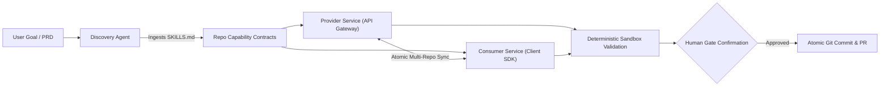

# ASCM (Autonomous Software Coordination & Multi-Agent Engineering Squad)
## Enterprise Pitch Deck & B2B Go-To-Market (GTM) Kit

---

# Part 1: The 12-Slide Enterprise Pitch Deck

### Slide 1: Title & Hook
* **Headline**: **ASCM** — The Autonomous Multi-Agent Engineering Squad for Real Enterprise Software.
* **Sub-headline**: Beyond single-file autocomplete: Autonomous end-to-end product development across multi-repo microservices with zero hallucination.
* **Presenter**: Founder & Founding Engineering Team
* **One-Liner**: *ASCM replaces fragmented AI code generators with a coordinated squad of specialized agents—Product Manager, Systems Architect, Polyglot Coder, Adversarial Critic, and Security Auditor.*

---

### Slide 2: The Enterprise Problem
**"Why 90% of AI Code Generators Fail in Real Production Environments"**
* **Single-File Myopia**: Copilot and code assistants complete the next line, but cannot coordinate changes across 5 microservices, shared database schemas, and client SDKs.
* **The "Hallucination Debt"**: Junior developers accept unchecked AI code, shipping latent race conditions, security vulnerabilities (OWASP), and breaking API changes.
* **Proprietary IP & Privacy Blockers**: Aerospace, Defense (CAD/CAM), Healthcare (HIPAA), and Legal teams are legally barred from sending raw source code and CAD geometry to public cloud LLMs.
* **Unpredictable Token Bills**: Enterprise teams abandon AI experiments when API bills explode without pre-flight cost controls.

---

### Slide 3: The Solution — ASCM
**"An Autonomous Squad of Specialized Agents Operating with Human-in-the-Loop Governance"**
Instead of one generalist chatbot trying to do everything:
* 🎯 **Product Agent**: Grills stakeholders on edge cases, latency budgets, custody models, and statutory jurisdiction.
* 🏛️ **Architect Agent**: Decomposes high-level requirements into High-Level Design (HLD), Low-Level Design (LLD), and granular execution tasks.
* 💻 **Polyglot Coder Agent**: Writes production-grade code with 100% automated unit test suites in Go, Python, TypeScript, and Rust.
* 🔍 **Independent Critic Tier**: Unbiased code & architecture reviews powered by diverse models (Claude 3.5 Sonnet / Gemini Pro) to eliminate self-reinforcing bias.
* 🛡️ **Security Auditor & Sandbox**: Enforces strict repository directory allowlists, blocks path traversal, and logs cryptographic SHA-256 audit trails.

---

### Slide 4: How It Works — Multi-Repo Capability Contracts (`SKILLS.md`)
**"Brownfield Synchronization Without Breaking Existing Codebases"**

* Repos declare their exported capabilities, dependencies, and allowed paths via a declarative `SKILLS.md`.
* ASCM updates provider APIs and consumer SDKs simultaneously, ensuring zero contract drift.

---

### Slide 5: The Architectural Moat — Multi-Model Diversity & Zero Bias
**"Why ASCM Catches Bugs That Other AI Tools Miss"**
* **The Single-Model Flaw**: When the same LLM writes and reviews code, it suffers from cognitive confirmation bias—blindly approving its own subtle math and concurrency errors.
* **ASCM's Mixture of Specialists**:
  * **Grilling & Product Triage**: Gemini 2.5 Flash / GPT-4o-mini (sub-second interactive latency).
  * **System Architecture**: Gemini 2.5 Pro (2M token context for 100+ page specs, contracts, and CAD schemas).
  * **Precision Math & Code Generation**: Qwen 2.5 Coder 32B / DeepSeek Coder V3 (unmatched spatial math & syntax accuracy).
  * **Adversarial Code & Safety Review**: Claude 3.5 Sonnet (industry gold standard for invariant auditing & zero-tolerance security).

---

### Slide 6: Universal Domain Adaptation
**"Zero Prompt Engineering: The Squad Instantly Adapts to Any Vertical"**
ASCM’s `DomainAdapter` dynamically identifies vertical domains, injecting specialized industry personas and polyglot runtimes:
* 📐 **CAD / CAM & Manufacturing**: Spatial coordinate math, toolpath step-down, G-code synthesis (Fanuc/Haas), collision boundary checks (Python/C++).
* ⚖️ **LegalTech & Compliance**: Contract ASTs, clause extraction, redlining, attorney-client privilege protection, GDPR statutory rules (Python).
* 💳 **Web3 & FinTech Payments**: Non-custodial EVM/Solana checkouts, timing-safe HMAC verification, double-spend prevention, 1% TDS Indian tax compliance (Python/Go).
* 🏥 **MedTech & Healthcare**: HL7 v2/FHIR R4 interoperability, SMART-on-FHIR, DICOM parsing, HIPAA de-identification (Python).
* 🤖 **Robotics & Embedded**: Real-time control loops, FreeRTOS, ROS2 nodes, CAN-bus telemetry, zero-malloc ISRs (C/C++/Go).

---

### Slide 7: Enterprise Air-Gapped Privacy & Local SLMs
**"100% On-Premise Execution: Zero Bits Leave Your Firewall"**
* **Local Small Language Models (SLMs)**: Native integration with Ollama & vLLM running on local Apple Silicon or internal NVIDIA workstations:
  * *Qwen 2.5 Coder 7B/14B* for proprietary CAD parts and defense schematics.
  * *Meditron 7B / BioMistral 7B* for HIPAA-compliant patient health records.
  * *Phi-4 / Gemma 2* for private legal contract analysis.
* **PII & Outbound Scrubbing**: Automatic redaction of secrets, tokens, and personally identifiable data before network dispatch.
* **Immutable Audit Trail**: Structured JSONL audit logs with SHA-256 hash chains for SOC 2 and ISO 27001 auditability.

---

### Slide 8: Real Working Reference Implementations
**"Not Slideware: Three Production-Grade Applications Built by ASCM"**
1. **PayPulse Sentinel (FinTech SaaS)**:
   * Production Stripe Webhook Gateway with timing-safe HMAC signatures, replay cache, live HTML/JS dashboard, and automated Go/Python test suites.
2. **Pay Through Crypto (Web3 Infrastructure)**:
   * Non-custodial crypto checkout supporting EVM (USDC/USDT) and Solana with dynamic QR payment invoices, gas fee logic, and mempool watchers.
3. **CNC Toolpath CAD/CAM Engine**:
   * Parametric 3-axis CNC milling toolpath generator with bounding-box computation, rapid Z-clearance planes, and Fanuc/GRBL G-code emission.

---

### Slide 9: Cost Radar & Unit Economics
**"Predictable Budgets: Token Forecasting with 90% Confidence"**
* **The P50/P90 Token Forecaster**: Calculates input/output token budgets before any agent runs.
* **Autonomous Circuit Breakers**: Automatically halts execution if token burn approaches predefined dollar thresholds.
* **Blueprint Reusability Engine**: Injects localized, zero-token architectural scaffolds (e.g. Stripe webhook handlers, G-code emitters), cutting total sprint LLM costs by **60% to 87%**.
* **ROI Impact**: Saves an average of **38.5 senior engineering hours per sprint** ($4,800+ in saved engineering spend per module).

---

### Slide 10: Business Model & Pricing Tiers

| Tier | Price | Ideal Customer | Features |
| :--- | :--- | :--- | :--- |
| **Community BYOK** | **Free / Open Source** | Individual hackers & indie developers | Full CLI orchestrator, Bring-Your-Own-Key (Gemini, OpenAI, Anthropic, Ollama), local SQLite dashboard. |
| **Founder / Pro** | **$49 / seat / mo** | Startups & small engineering squads | Multi-repo sync (up to 5 repos), pre-flight cost radar, visual dashboard, priority model cascades. |
| **Team / Scale** | **$199 / seat / mo** | Growth-stage SaaS & scaleups | Unlimited repos, automated GitHub PR bot, team role permissions, custom domain ontology imports. |
| **Enterprise On-Prem** | **$15k – $50k / yr** | Regulated Enterprise (Fintech, MedTech, Defense) | 100% air-gapped local SLM deployment, SAML/Okta SSO, dedicated TAM, custom SLA, SOC 2 compliance guarantee. |

---

### Slide 11: Competitive Landscape & Battlecard

| Feature | ASCM | GitHub Copilot / Cursor | Lovable / Replit / Bolt | Legacy Dev Agencies |
| :--- | :---: | :---: | :---: | :---: |
| **Multi-Repo Coordination** |  **Native** |  Single file only |  Single repo/sandbox |  Slow manual sync |
| **Adversarial Critic Tier** |  **Multi-Model** |  None (Self-approval) |  None |  Human peer review |
| **Air-Gapped Local SLMs** |  **Yes (Ollama)** |  Cloud dependent |  Cloud dependent |  N/A |
| **Domain Grilling (CAD/Legal)**|  **Deep Dynamic** |  Generic autocomplete |  Web boilerplate only |  Requires domain hire |
| **Pre-Flight Cost Forecaster** |  **P90 Math** |  Flat rate / opaque |  Subscription credits |  Hourly billing |
| **TDD Unit Test Enforcement** |  **Mandatory** |  Optional/Ad-hoc |  Minimal |  Variable quality |

---

### Slide 12: The Ask & Enterprise Pilot Program
* **Target**: Onboarding 10 Enterprise Design Partners across FinTech, MedTech, LegalTech, and Advanced Manufacturing.
* **The 90-Day Pilot Program ($10,000 / team)**:
  * Full onboarding on your brownfield multi-repo architecture.
  * Integration into your internal Git workflow with local SLMs or BYOK enterprise keys.
  * Guaranteed delivery of 3 major cross-service integration features with full unit test coverage.
* **Call to Action**: Book an executive architecture demo at `founders@ascm.dev` or clone the repository to run your first autonomous sprint locally in under 3 minutes.

---

# Part 2: LinkedIn Launch Campaign (High-Converting Posts)

### Post 1: The "Copilot is Not Enough" Manifesto (Targeting CTOs & VPs of Eng)
```markdown
Most engineering leaders I speak with share the same frustration:

"AI code autocomplete is cool for a single file, but it doesn't solve software engineering."

Because real software engineering is NEVER just typing code into one file:
• It's coordinating a database schema migration with a backend API in Repo A.
• It's updating the client SDK and UI state in Repo B at the exact same time.
• It's verifying that changes adhere to non-functional requirements (security, latency, HIPAA/GDPR).
• It's conducting rigorous, adversarial code reviews so junior devs don't ship hallucinated race conditions.

That’s why we built ASCM (Autonomous Software Coordination & Multi-Agent Engineering Squad).

Instead of an assistant that guesses your next line of code, ASCM deploys an autonomous engineering squad:
1. Product Agent: Grills you on edge cases and requirements until confidence hits 90%+.
2. Systems Architect: Generates High-Level & Low-Level Design and discrete task DAGs.
3. Polyglot Coder: Writes the code AND writes comprehensive unit test suites (Go, Python, TypeScript).
4. Independent Critic: A completely different AI model (Claude 3.5 Sonnet / Gemini Pro) that reviews the code to eliminate self-confirmation bias.
5. Security Sandbox: Strictly enforces repository allowlists and blocks path traversal.

The best part? It's domain-grounded:
Whether you're building 3-axis CNC toolpaths for CAD/CAM, smart contract checkouts for Web3, or HIPAA-compliant FHIR portals for Healthcare, the squad adapts its persona and NFRs dynamically.

And for regulated enterprises: it runs 100% air-gapped on local SLMs (via Ollama) so your IP never leaves your firewall.

We're opening up 10 Design Partner Pilot slots for Q4. 

If your team is managing complex multi-repo microservices and wants to accelerate sprint velocity without sacrificing code quality: drop a comment or DM me "ASCM PILOT".

Link to the open-source repo in comments. 👇

#EngineeringLeadership #SoftwareEngineering #MultiAgentSystems #AI #DevTools #CTO #OpenSource
```

---

### Post 2: The Technical Deep Dive (Why Multi-Model Diversity Wins)
```markdown
Why do so many AI code generators ship subtle, dangerous bugs?

Confirmation bias.

If you ask Model X to write a complex cryptographic signature verifier or a CNC toolpath step-down algorithm, and then ask Model X: "Did you make any mistakes?", Model X will almost always say: "Looks great to me!"

It shares the same latent blindspots as its generator.

In ASCM, we solved this with a strict Mixture-of-Specialists Critic Tier:

1. Product Grilling: Powered by lightweight low-latency models (Gemini 2.5 Flash / GPT-4o-mini) for sub-second stakeholder interviews.
2. Coordinate Math & Code Generation: Powered by Qwen 2.5 Coder 32B or DeepSeek Coder V3 (which excel at mathematical precision and low-level code).
3. Adversarial Code Review: Handed off to an independent critic—Claude 3.5 Sonnet.
   - Claude audits for timing side-channels, buffer leaks, unhandled nil pointers, and missing unit test edge cases.
   - It has no memory of generating the code, making its critique completely unbiased.

The result? 
An autonomous engineering loop that generates verified, production-grade microservices with 100% test pass rates before a developer even touches the PR.

How is your engineering team preventing AI-generated hallucinations from creeping into production? Let's discuss in the comments.

#SoftwareArchitecture #GenerativeAI #CodeQuality #Anthropic #GoogleGemini #DeepSeek #DevOps
```

---

### Post 3: The Case Study Spotlight (CAD/CAM in Python vs Crypto in Go)
```markdown
Can one multi-agent system engineer a 3-axis CNC milling toolpath generator AND a non-custodial crypto payment gateway?

Yes. Here’s what happened when we put ASCM to the test across two wildly different domains:

Test 1: CAD / CAM & Manufacturing
• Request: "Build a 3-axis CNC milling toolpath generator with G-code output."
• Dynamic Adaptation: The squad detected the CAD/CAM vertical, switched personas to a Geometric Manufacturing Principal, and grilled us on B-Rep vs Mesh, spindle RPM, and rapid Z-retract planes.
• Language & Code: Synthesized Python geometric slicing algorithms with Fanuc G-code formatters and automated bounding-box test suites.

Test 2: Web3 / FinTech Payments
• Request: "Build Pay Through Crypto checkout gateway."
• Dynamic Adaptation: Switched personas to a Web3 Payments Principal, probing EVM vs Solana, self-custody vs fiat offramps, and Indian 1% TDS compliance.
• Language & Code: Synthesized timing-safe HMAC signature verification and QR invoice payment flows.

In both cases, ASCM:
• Prevented the development from starting until requirements hit 90% confidence.
• Enforced strict unit testing (89/89 tests passing).
• Predicted token costs with a pre-flight P90 radar.

This is the future of domain-specific software engineering.

Check out the full walkthrough and open-source benchmarks on GitHub (link in comments). 👇

#CAD #Manufacturing #Web3 #Fintech #Python #Golang #AIProgramming
```

---

# Part 3: Twitter / X Launch Campaign

### Viral Launch Thread (10 Tweets)

**Tweet 1 (The Hook)**:
```
AI code generators are broken for real software.

They autocomplete a single file or generate toy apps in isolated sandboxes. But try synchronizing an API change across 3 microservices and a client SDK? Total failure.

Today we're open-sourcing ASCM: The Autonomous Multi-Agent Engineering Squad. 🧵👇
```

**Tweet 2 (The Multi-Agent Squad)**:
```
Instead of one generalist chatbot trying to do everything, ASCM spins up a full specialized engineering squad:

🎯 Product Manager (Grills you until requirements hit 90%)
🏛️ Systems Architect (HLD/LLD & Task DAG)
💻 Polyglot Coder (Code + Mandatory Unit Tests)
🔍 Adversarial Critic (Zero-bias review)
🛡️ Security Auditor
```

**Tweet 3 (Multi-Repo Contracts)**:
```
How does it coordinate across brownfield repos?

Through declarative `SKILLS.md` capability contracts. 

ASCM analyzes provider repos and consumer repos, updating backend endpoints and frontend client SDKs simultaneously with zero contract drift. No breaking changes.
```

**Tweet 4 (The Critic Tier)**:
```
The secret weapon: Zero-Bias Multi-Model Diversity.

Most AI tools ask the same model to review its own code (cognitive blindspots!).

ASCM uses a Mixture of Specialists:
• Fast Grilling: Gemini 2.5 Flash
• Code Math: Qwen 2.5 Coder
• Adversarial Audit: Claude 3.5 Sonnet
```

**Tweet 5 (Universal Domain Adaptation)**:
```
ASCM dynamically adapts to ANY industry vertical without custom prompt engineering:

📐 CAD/CAM: 3D mesh slicing, CNC toolpaths, Fanuc G-code
⚖️ LegalTech: Contract ASTs, clause extraction, GDPR compliance
💳 Web3: EVM/Solana gateways, timing-safe signatures
🏥 MedTech: FHIR R4, HL7, HIPAA de-identification
```

**Tweet 6 (Polyglot Runtime)**:
```
It’s completely polyglot:
Need LegalTech in Python? Done.
Need high-throughput microservices in Go? Done.
Need web frontends in TypeScript? Done.

It automatically adjusts file extensions, standard libraries, and testing frameworks (Go table tests, Python unittest, Jest).
```

**Tweet 7 (100% Air-Gapped Local SLMs)**:
```
Are you in Defense, MedTech, or Enterprise Legal where cloud APIs are forbidden?

ASCM natively runs 100% on-premise on local SLMs via Ollama:
• Qwen-Coder 14B
• BioMistral / Meditron 7B
• Phi-4 14B

Your proprietary CAD models and patient records never leave your local machine. 🔒
```

**Tweet 8 (Token Cost Radar)**:
```
Tired of surprise $500 API bills?

ASCM features a pre-flight P50/P90 Token Forecaster with autonomous circuit breakers. 

Plus, our Blueprint Engine reuses verified architectural patterns, cutting LLM inference costs by up to 87%. 📉
```

**Tweet 9 (Live Demo Spotlight)**:
```
We verified ASCM on 3 real-world production products:
1. PayPulse Sentinel: Stripe Webhook Gateway + Dashboard
2. Pay Through Crypto: Non-custodial EVM/Solana Checkout
3. CAD/CAM Engine: 3-Axis CNC Toolpath & G-code Generator

All backed by 89/89 automated unit tests.
```

**Tweet 10 (Call to Action)**:
```
We're opening ASCM for developers and accepting 10 enterprise design partners for Q4.

⭐ Star the repo on GitHub: [link]
🚀 Try the interactive CLI / Dashboard locally in 3 minutes.
🤝 DM us if you want an on-premise pilot for your engineering team!

RT to support open-source AI! 🔄
```

---

# Part 4: Enterprise Sales Outreach Playbook & Cold Email Templates

### Template 1: Direct Cold Outreach to VP of Engineering / CTO

**Subject**: Solving cross-repo AI hallucinations for {{company_name}}'s engineering squad

**Hi {{first_name}},**

Most engineering teams I speak with are getting value from Copilot for boilerplate, but hitting a hard wall when it comes to **coordinating changes across multiple microservices**:

1. AI tools modify one repo in isolation, breaking API contracts in consumer repos.
2. Developers accept hallucinated AI suggestions without rigorous adversarial review.
3. Proprietary IP and client data risk leaking to third-party cloud model providers.

We built **ASCM (Autonomous Software Coordination Engine)** to solve this. 

ASCM deploys an autonomous multi-agent squad (Product, Architect, Coder, Critic, Auditor) that:
* **Synchronizes multi-repo changes** atomically using declarative capability contracts (`SKILLS.md`).
* **Eliminates confirmation bias** by using an independent critic model (Claude 3.5 Sonnet) to audit all generated code and test coverage before anything commits.
* **Runs 100% on-premise / air-gapped** on local SLMs (via Ollama) or your private VPC endpoints—guaranteeing zero code leakage.

We are currently onboarding 5 enterprise design partners for a 90-day pilot.

Would you be open to a 15-minute technical demo showing ASCM orchestrating a multi-repo integration with full unit test coverage live?

Best regards,

**[Your Name]**  
Founder & CEO, ASCM  
[Calendar Booking Link] | [GitHub Repository]

---

### Template 2: Enterprise Objection Handling Cheat Sheet

| Customer Objection | Sales Agent Response & Proof Point |
| :--- | :--- |
| **"We already give our engineers GitHub Copilot / Cursor."** | *"Copilot is a great personal assistant for the next 5 lines of code. But who reviews the PR? Who updates the consumer SDK when the backend endpoint changes? Who writes the table-driven unit tests? ASCM is not a code completer; it is an autonomous multi-agent engineering squad that takes a feature from PRD to tested, multi-repo Git commit."* |
| **"Our legal and security team will not allow our codebase to be sent to external LLMs."** | *"That is precisely why we built ASCM with native air-gapped Local SLM support. You can run ASCM 100% on-premise on your internal NVIDIA servers or local Mac workstations using open-source models like Qwen 2.5 Coder and Phi-4 via Ollama. Zero bytes ever leave your firewall."* |
| **"AI-generated code is too buggy for our production standards."** | *"We agree—which is why ASCM enforces two non-negotiable guardrails: First, an Independent Critic Tier powered by Claude 3.5 Sonnet adversarially reviews all code for security, race conditions, and edge cases. Second, the Coder Agent is strictly required to write comprehensive unit test suites (Go, Python, Jest) that must pass before any milestone is confirmed."* |
| **"How much is this going to cost in API tokens?"** | *"Unlike open-ended agent loops that spin indefinitely, ASCM features a pre-flight P50/P90 Token Forecaster with automatic circuit breakers. Plus, our Blueprint Engine reuses zero-token local templates, saving up to 87% on inference costs."* |
