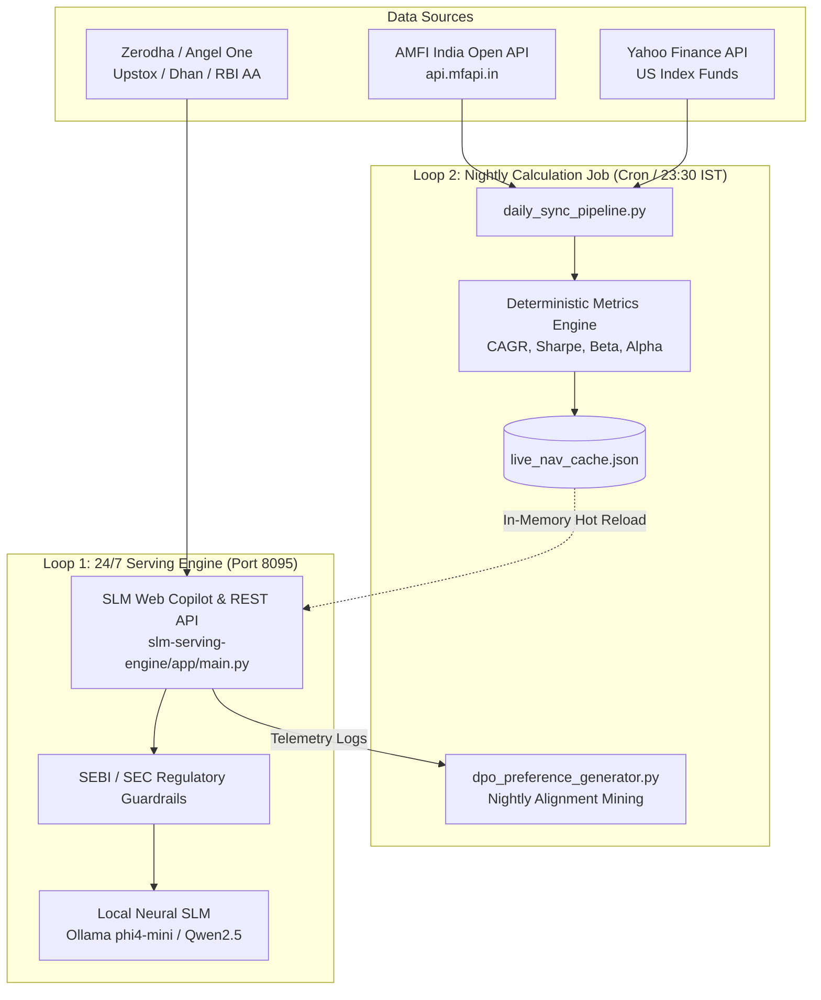

# Mutual Funds SLM Production Deployment Guide

This guide details how to deploy and operate the **Mutual Funds Small Language Model (SLM) Copilot**, including the **24/7 Web Serving Engine** and the **Automated Nightly Calculation & Sync Pipeline**.

---

## 1. Architecture Overview: Two Operating Loops

The SLM Copilot operates on a **decoupled, dual-loop architecture**:



### Why Neural Weights Don't Need Daily Retraining
Traditional models hallucinate because they bake fluctuating numbers (like today's NAV) into their static weights. The Mutual Funds SLM uses **Deterministic Tool-Grounded In-Context Architecture**:
1. The **Nightly Job** updates the exact mathematical state (NAVs, CAGRs, Sharpe ratios, Alpha, Beta) in `live_nav_cache.json`.
2. The **Serving Engine** injects these fresh, verified figures directly into the SLM prompt context at runtime.
3. The SLM provides natural language reasoning over **100% verified mathematical facts**, achieving zero calculation hallucination without requiring expensive model retraining.

---

## 2. Quick-Start Deployment Options

### Option A: 1-Click Docker Compose (Recommended for Cloud VMs)

The Docker Compose stack provisions:
1. `mf-slm-ollama`: Edge neural engine with GPU/CPU acceleration.
2. `mf-slm-model-puller`: Automatically downloads `phi4-mini:latest` on first launch.
3. `mf-slm-serving`: Web Copilot UI and REST API on port `8095`.
4. `mf-slm-sync-job`: Background daemon running the calculation pipeline every 24 hours.

```bash
cd products/mutual-funds-slm
./deploy_production.sh docker
```

To view logs:
```bash
docker compose logs -f
```

---

### Option B: Native Host / Virtualenv Deployment

Ideal for existing Linux (Ubuntu/Debian/RHEL) servers, macOS, or lightweight VPS instances:

```bash
cd products/mutual-funds-slm
./deploy_production.sh native
```

To inspect system health anytime:
```bash
./deploy_production.sh status
```

---

## 3. The Scheduled Calculation Job: Step-by-Step

### When does it run?
Mutual Fund AMCs in India report day-end NAVs to AMFI between **9:00 PM and 11:00 PM IST**.
Therefore, the production job is scheduled for **23:30 IST (18:00 UTC)**.

### What calculations are performed?

For each scheme, the calculation pipeline executes deterministic formulas:

| Metric | Mathematical Formula | Purpose |
| :--- | :--- | :--- |
| **CAGR (1Y, 3Y, 5Y)** | $\text{CAGR} = \left(\frac{\text{NAV}_{\text{end}}}{\text{NAV}_{\text{start}}}\right)^{\frac{1}{t}} - 1$ | Annualized multi-year compound growth |
| **Annualized Volatility ($\sigma$)** | $\sigma = \sqrt{252} \times \text{StdDev}(R_{\text{daily}})$ | Measures fund price swing risk |
| **Sharpe Ratio** | $\text{Sharpe} = \frac{R_p - R_f}{\sigma_p}$ ($R_f = 6.5\%$ RBI Repo) | Risk-adjusted excess return |
| **Beta ($\beta$)** | $\beta = \frac{\text{Cov}(R_p, R_{\text{bench}})}{\text{Var}(R_{\text{bench}})}$ | Systematic market sensitivity against NIFTY 100/500 TRI |
| **Jensen's Alpha ($\alpha$)** | $\alpha = R_p - [R_f + \beta (R_{\text{bench}} - R_f)]$ | Manager's genuine excess value-add |
| **Tracking Error** | $\text{TE} = \sqrt{\frac{1}{n-1} \sum (R_{p,i} - R_{b,i})^2}$ | Divergence of index fund from underlying benchmark |

### Setting Up the Cron Job

Edit your crontab on the host:
```bash
crontab -e
```

Add the following entry:
```bash
# Run every night at 23:30 IST (18:00 UTC)
00 18 * * * /bin/bash /opt/ascm-poc/products/mutual-funds-slm/cron/sync_job.sh >> /opt/ascm-poc/products/mutual-funds-slm/data-pipeline/logs/cron_output.log 2>&1
```

### Or Using Systemd Timer (Linux Modern Standard)

Copy the provided unit files to systemd:
```bash
sudo cp products/mutual-funds-slm/systemd/mutual-funds-slm.service /etc/systemd/system/
sudo cp products/mutual-funds-slm/systemd/mutual-funds-sync.service /etc/systemd/system/
sudo cp products/mutual-funds-slm/systemd/mutual-funds-sync.timer /etc/systemd/system/

sudo systemctl daemon-reload
sudo systemctl enable --now mutual-funds-slm.service
sudo systemctl enable --now mutual-funds-sync.timer
```

---

## 4. Triggering Immediate On-Demand Calculations

You can trigger calculation and sync on-demand at any time without waiting for the nightly cron:

```bash
# Via deployment CLI
./products/mutual-funds-slm/deploy_production.sh sync-now

# Or via REST API
curl -X POST http://localhost:8095/api/sync/trigger
```

---

## 5. Hardware Requirements & Cost Economics

| Component | Minimum Specification | Recommended Specification |
| :--- | :--- | :--- |
| **CPU** | 2 Cores (x86_64 or ARM64) | 4 Cores |
| **RAM** | 4 GB | 8 GB |
| **Disk** | 10 GB SSD | 25 GB SSD |
| **GPU** | Not required (CPU INT4 quantized) | Optional (Apple Silicon Metal / NVIDIA T4) |
| **Monthly Cost** | **$12 - $18 / month** (DigitalOcean / Hetzner) | **$24 - $35 / month** (AWS t4g.xlarge / DO) |

**Cloud LLM Cost Comparison**:
- OpenAI GPT-4o API for 5,000 portfolio analyses/day: **~$1,800 - $3,500/month**.
- Mutual Funds SLM Edge Deployment: **$18/month fixed** (Zero marginal token cost + 100% data privacy).
