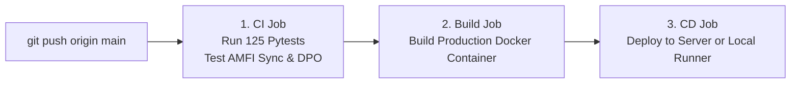

# Complete DevOps Guide: Local Laptop Hosting, Nginx, and GitHub Actions CI/CD

This guide explains how to host the **Mutual Funds SLM** from your **local laptop**, configure **Nginx** as a reverse proxy, and set up **GitHub Actions CI/CD** to automate tests and deployments.

---

## 1. Hosting from Your Local Laptop: Is it Possible?

**YES, absolutely.** You do not need an expensive cloud server to host your app publicly or learn DevOps. Modern tools allow you to securely expose your laptop to the public internet with HTTPS without opening router ports or paying for static IPs.

### The Top 3 Local Hosting Ingress Tools

| Tool | How It Works | Best For | Cost |
| :--- | :--- | :--- | :--- |
| **Cloudflare Tunnel (`cloudflared`)** *(Recommended)* | An outbound daemon on your laptop establishes an encrypted tunnel to Cloudflare's edge network. Traffic to `yourdomain.com` is routed directly to your local port. | Permanent hosting, custom domains, free automatic SSL & DDoS protection. | **100% Free** |
| **ngrok** | Secure reverse proxy tunnel from public URL to `localhost`. | Quick testing, webhook callbacks, sharing demos in 10 seconds. | Free tier available |
| **Tailscale Funnel** | Exposes an internal Tailscale node to the public internet. | Private dev teams, personal infrastructure. | Free tier available |

---

## 2. Hands-On: Hosting with Cloudflare Tunnels (10-Minute Setup)

### Step 1: Install `cloudflared` on macOS
```bash
brew install cloudflared
```

### Step 2: Instant Free Temporary Tunnel (No Account Required)
To immediately expose your local SLM Copilot (port 8095) with a public HTTPS link:
```bash
cloudflared tunnel --url http://localhost:8095
```
Cloudflare will output a public URL like:
```text
https://random-words.trycloudflare.com -> http://localhost:8095
```
You can share this link with anyone, test on your mobile phone, or connect broker webhooks!

### Step 3: Permanent Custom Domain (e.g., `slm.yourdomain.com`)
1. Create a free account at [Cloudflare.com](https://dash.cloudflare.com).
2. Authenticate the CLI:
   ```bash
   cloudflared tunnel login
   ```
3. Create your named tunnel:
   ```bash
   cloudflared tunnel create mf-slm-tunnel
   ```
4. Route your domain:
   ```bash
   cloudflared tunnel route dns mf-slm-tunnel slm.yourdomain.com
   ```
5. Run the tunnel pointing to your local Nginx (port 80) or SLM server (port 8095):
   ```bash
   cloudflared tunnel run --url http://localhost:80 mf-slm-tunnel
   ```

---

## 3. Learning Nginx: Reverse Proxy, Rate Limiting & SSL

### Why do we put Nginx in front of Python/SLM?
In production, you never expose Python directly to the internet. Nginx acts as the **front gatekeeper**:
1. **Reverse Proxy**: Accepts public requests on port 80/443 and forwards them to internal container ports (`slm-serving:8095`).
2. **Rate Limiting**: Protects your SLM from denial-of-service (DoS) and API abuse. In our configuration, we limit to 20 requests/second with a burst of 40:
   ```nginx
   limit_req_zone $binary_remote_addr zone=slm_api_limit:10m rate=20r/s;
   ```
3. **Connection Buffering & Keep-Alive**: Nginx handles slow mobile clients and gzip compression, freeing Python to focus solely on inference and financial calculations.
4. **Security Headers**: Injects protection against clickjacking (`X-Frame-Options`), MIME-sniffing (`X-Content-Type-Options`), and XSS attacks.

### Running Nginx Locally with Docker Compose
We added Nginx into [`docker-compose.yml`](file:///Users/komanduri/Downloads/projects/googledeepagenthackathon/goproject/ascm-poc/products/mutual-funds-slm/docker-compose.yml) and configured it in [`nginx/nginx.conf`](file:///Users/komanduri/Downloads/projects/googledeepagenthackathon/goproject/ascm-poc/products/mutual-funds-slm/nginx/nginx.conf).

To launch the full stack including Nginx on port 80:
```bash
cd products/mutual-funds-slm
docker compose up -d
```
Test Nginx locally:
```bash
curl -I http://localhost/healthz
# Returns: HTTP/1.1 200 OK
```

---

## 4. Learning CI/CD with GitHub Actions

### What is CI/CD?
- **CI (Continuous Integration)**: Automatically tests, lints, and builds your code every time you or a teammate pushes to GitHub. If a test fails, the commit is flagged red before it breaks production.
- **CD (Continuous Deployment)**: Automatically deploys the tested code to your server (or local runner) as soon as it merges into `main`.

### How Our GitHub Actions Workflow Operates
We created [`.github/workflows/ci-cd.yml`](file:///Users/komanduri/Downloads/projects/googledeepagenthackathon/goproject/ascm-poc/.github/workflows/ci-cd.yml). It has 3 stages:



1. **Test & Validate**:
   - Boots an Ubuntu virtual machine on GitHub's cloud.
   - Installs Python 3.12 and dependencies.
   - Runs all 125 unit tests across the repo.
   - Runs the live AMFI calculation job (`daily_sync_pipeline.py --run-once`).
   - Runs the DPO preference pair generator.
2. **Docker Build Verification**:
   - Builds `products/mutual-funds-slm/Dockerfile` to guarantee there are no container packaging bugs.
3. **Continuous Deployment (CD)**:
   - Triggers automated deployment.

---

## 5. Next-Level DevOps: GitHub Self-Hosted Runner on Your Laptop

Did you know GitHub Actions can deploy **directly to your laptop** whenever you push code?
GitHub provides **Self-Hosted Runners**: an agent you run on your machine that listens for GitHub Actions workflow jobs.

### How to Set It Up on Your Laptop:
1. Go to your GitHub repository: `https://github.com/gopikomanduri/ascm-poc/settings/actions/runners`
2. Click **"New self-hosted runner"** and select **macOS**.
3. Follow the 3-step download and install commands provided by GitHub:
   ```bash
   mkdir actions-runner && cd actions-runner
   curl -o actions-runner-osx-arm64.tar.gz -L https://github.com/actions/runner/releases/download/...
   tar xzf ./actions-runner-osx-arm64.tar.gz
   ./config.sh --url https://github.com/gopikomanduri/ascm-poc --token YOUR_TOKEN
   ./run.sh
   ```
4. Now, in [`.github/workflows/ci-cd.yml`](file:///Users/komanduri/Downloads/projects/googledeepagenthackathon/goproject/ascm-poc/.github/workflows/ci-cd.yml), set `runs-on: self-hosted`.
5. Whenever you do `git push origin main`:
   - GitHub instructs your local runner on your laptop to pull the latest commit, run tests, and reload `docker compose up -d`!

---

## 6. Summary of What to Practice

1. **Local Ingress**: Run `cloudflared tunnel --url http://localhost:8095` to get an instant public HTTPS link.
2. **Reverse Proxying**: Inspect [`nginx/nginx.conf`](file:///Users/komanduri/Downloads/projects/googledeepagenthackathon/goproject/ascm-poc/products/mutual-funds-slm/nginx/nginx.conf) to understand proxy headers and rate limits.
3. **CI Pipeline**: Visit your repo's **Actions** tab on GitHub (`https://github.com/gopikomanduri/ascm-poc/actions`) to watch your CI/CD pipeline execute in real time on every commit!
